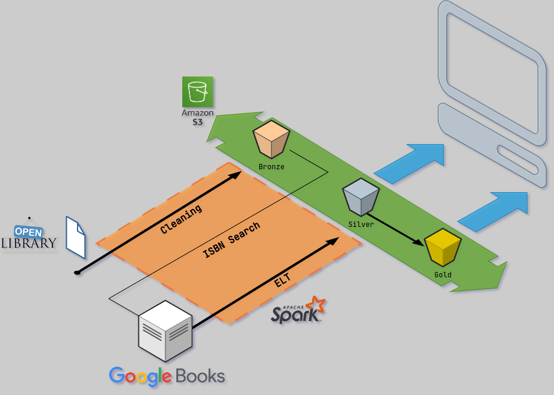

# Ohara

## Project Objectives

This project consists of a simple portfolio project (my first one in Data Engineering) with the main goal of practicising skills on Pyspark. With that in mind, the idea of this project is to create a Data Lake structure from a big dataset of Books Information, using the most complete data sources available on the internet.

## Data Sources

After deep searching, two data sources were selected for this project:

- Open Library: Open Library is a open and editable online book catalog. From it, big dumps of books could be obtained in a single file, which could generate a list of books to be searched on the second source.
- Google Books API: This second source were needed for the purpose of enriching the data of the books found on the Open Library dump, since it didn't contain much information. The books could be searched using it ISBN code as a parameter for the API requisitions. 

## Tools Utilized

For this project, two main tools were essentialy used:

- Apache Spark for data processing, acessed via Pyspark.
- AWS S3, for storing the Data Lake on the Cloud.

## Project Architecture

The architecture of this project is centered towards the idea of a Three-Layer Data Lake structure, sourced by two diferent Book Databases, as shown on the diagram below.

    

The pipeline starts with the import of a Data Dump from Open Library, which consists of a .txt file generated daily consisting of data of all books registered until that day. The format of the data is similar, but not exactly, like a JSON, and adjusting it required some ETL processing for each row. From the result, only the title and ISBN of the books were saved, forming a list of Book Identifiers that compose the Bronze Layer.

For the Silver Layer, each book ISBN on the Bronze Data is searched on the Google Books Database through it's API, and the resulting data, is saved first and them processed to a Tabular format with relevant information about each book, composing the Silver Layer.

Technically, the Silver Layer Data is ready for Data Analysis tasks, but since the dataset can become quite big, some operations can be made to generate resulting databases that could ease the work on the Analysis step. And that's the data present on the Golden Layer. On this specific project, it consists basically of some aggregatted views of the data, such as the Data grouped by Authors, Publishers and Genres.

## Conclusion

Pyspark has a quite different architecture compared to other Python packages, such as Pandas, which makes a little harder to learn it, but after some practice, it starts to feel more natural, specially when doing data transformations. But some other tasks, like making API requests and connecting to AWS, were not very natural and required some effort.

But overall, Spark is a quite interesting tool, specially considering it's speed, which is considerably higher than other frameworks.

## Next Possible Steps

- Migrate the Processing Code to an Cloud Tool, like AWS Glue, or AWS Batch.
- Use a Scheduling Tool, like Airflow to orchestrate all the processing steps.

